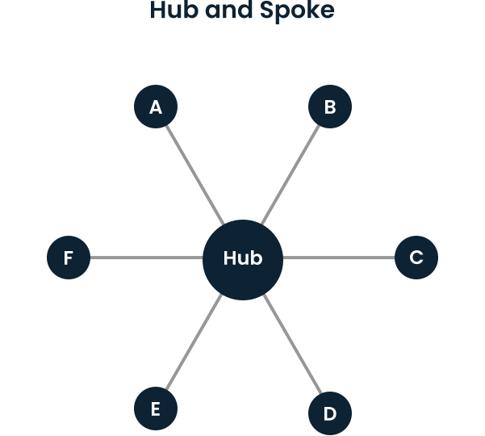
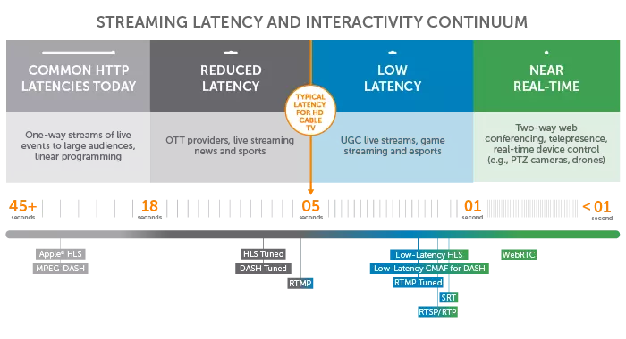
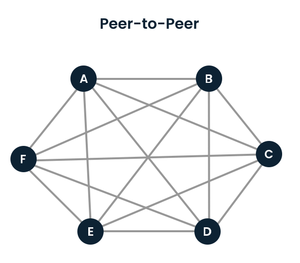

## Jack Trip notes

*from technical data documentations on website
*[\(this link\)](https://www.jacktrip.com/technology)

### Latency

- keeping a common rhythm
  
- common sense of pulse

- consequences are the happy birthday effect

- Video conference software is engineered for turn taking music making

- tightly synced performance on works with low latency audio applications like jack trip

RESEARCH HAS FOUND that the ability to perform sync rhythms requires latency of lower than 25-30 msec one way

Speed and temp of the piece matter. Slower tempi lower latency...

A sound travelling through air 25 feet (8 meters) takes about 25msec

### Optimizing Latency

Each stage of the below add latency

#### Geographical Latency

- The globe is laced with fibre optic cables, running across land and sea.
- Data travels at roughly 70% the speed of light across these backbone network segments.
- They travel from one to another at relay points called "network hops".
- The greater the distance the greater the number of hops.
- Low latency possible when musicians less than1000 km away
- 10-12 msec to go across large metropolitan area

#### Internet Service Latency

- The type of internet connection in a persons home determine sthe latency.
- Fiber to the home (FTTTH) being the fastest (2msec)
- DSL being one of the slowest (10 - 15msec)
- Internet *connection latency* not the same as *bandwidth*
- High bandwidth may not correspond to Low Latency.
- Tools to measure QoS are *speed test* and *round-trip ping time*. These will give rough approximation
- One Aspect of QoS which has great impact for latency is the  *smoothness of very fast data flows* (Audio Packet Jitter). This is best when connections are uncongested.

#### ADC and DAC Latency

- This is the hardware in your sound card or audio interface
- Laptops can have latency of 100ms
- Even best USB-based audio interfaces have total in out latency of 5ms to 15ms
- USe Hardware device designed for minimal Latency
- A jack-trip analog bridge, includes HiFiBerry has 1ms of Latency.

#### Performer Latency

- Bluetooth Devices are out. USe Analog only
- Speed of sound is about 1ms/foot or 3ms/meter.
- Headphones better for proximity delay than loudspeakers

### Connection TOPOLOGIES

When connecting remote performers together,  there are two common ways to wire up multiple sites: the *client-server (hub and spoke)* method and the *peer-to-peer(p2p)* method.

#### Client-Server Model

In this model every performers computer sends a *single copy* of their audio to a central server.

The Server mixes all the audio streams together and sends a single copy back to every performers computer.

The processing and bandwidth requirements for each performer remain constant and low, regardless of number of performers.

The Severs processing and bandwidth requirements grow proportionally to the number of performers.

Client server pattern more suitable for user with groups that are larger than a handful of performers.

##### **PROS**

- No Changes in performers home internet firewalls(except rarely)
- Minimal processing and bandwidth for performers copmuters and home internet

##### **CONS**

- Requires configuration and management of central hub (server)
- Adds latency through additional stage in the Audio path
  
#### Peer-to-peer Model

Each performers computer sends a copy of audio to every other performers computer.

Processing and bandwidth requirements for *each* performers computer are directly proportional to number of performers involved.

Todays laptops and home internet connections will max out at about 12 performers.

##### **PROS**

- No central server needed
- Achieves lowest Latency
  
##### **CONS**

- High processing requirements for each performers computer
- High upload and download requirements
- May require a lot of changes to performers home internet firewalls.
  
